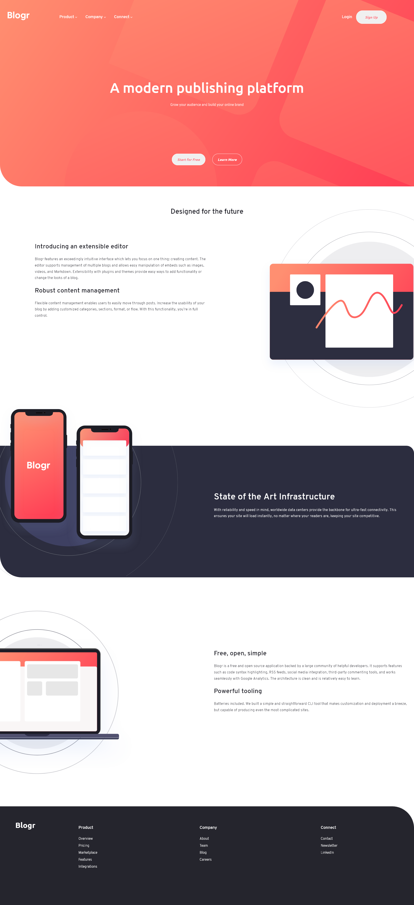

# Frontend Mentor - Blogr landing page solution

.png)

This is a solution to the [Blogr landing page challenge on Frontend Mentor](https://www.frontendmentor.io/challenges/blogr-landing-page-EX2RLAApP). Frontend Mentor challenges help you improve your coding skills by building realistic projects. 

## Table of contents

- [Overview](#overview)
  - [The challenge](#the-challenge)
  - [Screenshot](#screenshot)
  - [Links](#links)
  - [Built with](#built-with)
- [Author](#author)

## Overview
### The challenge

Users should be able to:

- View the optimal layout for the site depending on their device's screen size
- See hover states for all interactive elements on the page
### Screenshot

### Links

- Live Site URL: [Netlify](https://mocklandingpage.netlify.app/)

### Built with

- Semantic HTML5 markup
- jQuery
- CSS custom properties
- Flexbox
- Mobile-first workflow

## Author

* **Armand Gonda**
- Website - [Xenonyy](http://xenonyy.github.io/)